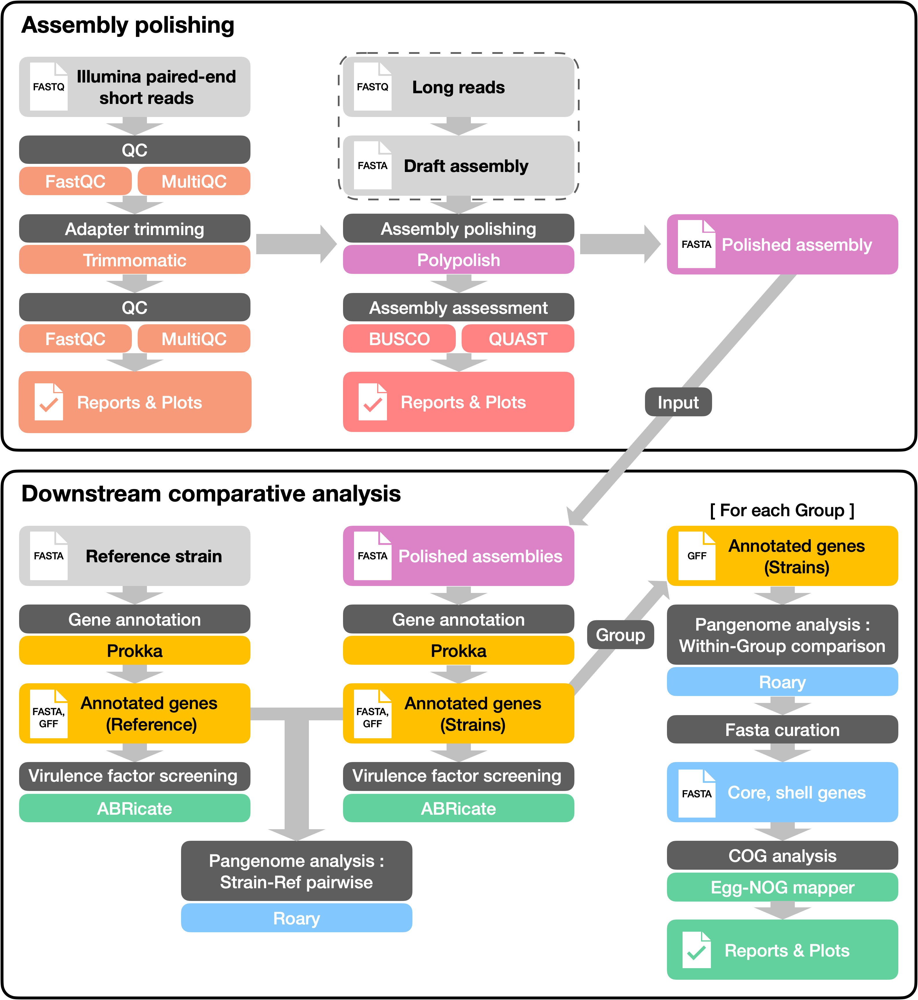

# ABComp : Assembly Polishing and Bacterial Whole-genome Comparison Pipeline for Multi-group Clinical Isolates

[](https://snakemake.github.io)



# Getting Started
## Installation

Clone and enter repository to create your workspace directory :

```bash
git clone https://github.com/young5454/ABComp.git
cd ABComp && mkdir {your_workspace}
```

⚠️ Make sure your workspace name is correctly specified in the configuration file (please see section [Configuration file](#configuration-file) for more detail).

## Directory structure and file names
ABComp starts with two main type of input data, the draft assembly of clinical isolates and Illumina paired-end short reads. In order for ABComp to run smoothly, the input data should be saved in a proper format of both directory structure and file names. 

The genomes and reads should be saved inside the workspace directory as below :

```
0.Assembly
└── {group}_{strain}
    ├── genome
    │   └── {group}_{strain}.fasta
    └── reads
        ├── {group}_{strain}_1.fastq.gz
        └── {group}_{strain}_2.fastq.gz
```

⚠️ Make sure all the file extensions strictly follow the names (`.fasta`, `.fastq.gz`) provided above. Also, the fastq read files should be gzipped beforehand. The directory names should **NOT** be altered.

⚠️ Make sure your `{group}` and `{strain}` names do **NOT** contain a underscore (_) inside. The name formats are intended to have the unique underscore so that during the Snakemake run, the group and strain wildcard info are automatically extracted and saved. Also, the file names should perfectly match the names provided in the configuration file (please see section [Configuration file](#configuration-file) for more detail).

The assembly polishing block will create a directory `trimmed/` inside each `{group}_{strain}/` folder after running adapter trimming, and save the trimmed reads. Also, the polished assemblies will be saved inside the `genome/` directory with a name format of `{group}_{strain}_polished.fasta`. 

⚠️ If you have your assemblies ready and plan to run only the downstream comparative analysis block, please save all of your genome assemblies with the name format of `{group}_{strain}_polished.fasta` inside the `genome/` directory.

## Configuration file
ABComp requires two configuration files for running the pipeline. These yaml files can be found in the `config/` directory. 

`config.yml` is a default configuration setting for the overall Snakemake run. Make sure you specify the correct parameters and directory names of your preference.

`groups_original.yml` is a configuration file for the complete group-strain information of your clinical isolates. Below is an example yaml file of a 2-group, 5-strain setting :

```YAML
NONMDR:
    - B0112
    - C0234
    - C3455
MDR:
    - B0232
    - D0991
```
⚠️ Make sure that the group and strain names perfectly match with the draft assembly name format : `{group}_{strain}.fasta`. For example, the B0112 strain should have the directory and file name of `NONMDR_B0112`.

## Conda environments
ABComp suggests single conda environment for a single software for avoiding potential dependency errors. Before running the pipeline, make sure you have all of the environments set with the provided yaml files. The yaml file of each individual environment can be found in `workflow/envs/`.

ABComp provides a single bash script `create_envs.sh` that creates all of the required conda environments at once. You can run the script with the following command :
```
bash create_envs.sh 
```

## Pre-downloaded databases
ABComp requires pre-downloaded databases for running **BUSCO** assembly assessment and **EggNOG-mapper**. Please refer to the website or Github of each software for more information :

### BUSCO lineage datasets
[BUSCO](https://busco.ezlab.org/busco_userguide.html#lineage-datasets/)

BUSCO lineage datasets contain sets of highly conserved single-copy genes specific to different evolutionary lineages. These datasets are used to evaluate the completeness of genome assemblies by comparing the presence of these key genes in the assembly. Pre-download the appropriate lineage dataset according to the lineage of the input strain. 
⚠️ Make sure the lineage datasets are saved inside a directory named `busco_downloads`, inside your workspace directory.

### EggNOG annotation databases
[EggNOG-mapper](https://github.com/eggnogdb/eggnog-mapper)

EggNOG-mapper databases consist of precomputed orthologous groups and functional annotations derived from a vast range of organisms. These databases enable the functional annotation of genes in your genome by mapping them to known orthologs and their associated functional data. Pre-downloading the necessary EggNOG-mapper databases ensures that the pipeline can efficiently perform functional annotation. 

⚠️ Please carefully read through the **Setup** section in the [EggNOG-mapper wiki](https://github.com/eggnogdb/eggnog-mapper/wiki/eggNOG-mapper-v2.1.5-to-v2.1.12#user-content-Setup). ABComp assumes you have downloaded all the annotation databases with running the script provided by EggNOG-mapper with a default option:

```bash
download_eggnog_data.py
```

That is, a directory named `data/` must be created within your EggNOG-mapper directory, then the above script is run to download all databases provided by EggNOG-mapper.